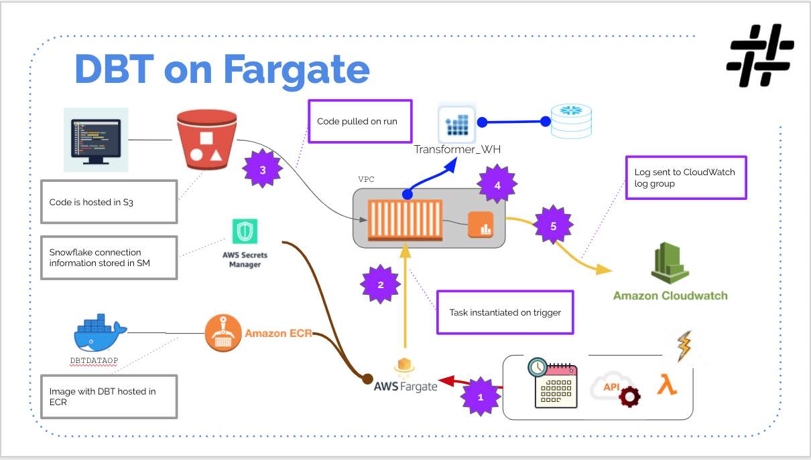
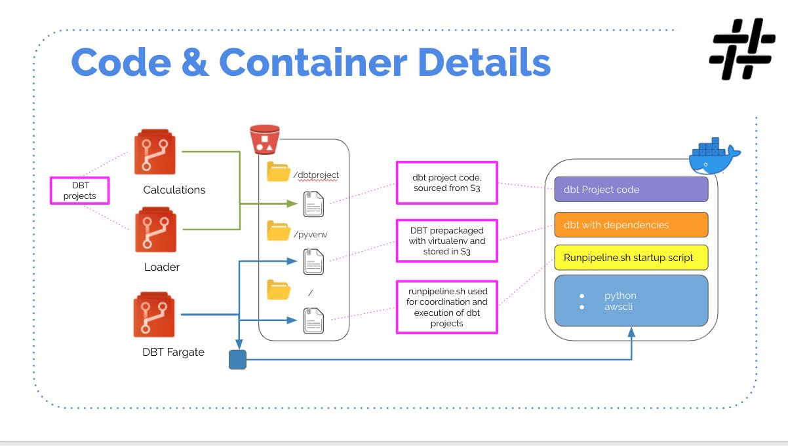

# DBT On Fargate

## Links
- [Queries](doc/Queries.md)
- [Deployment](doc/Deployment.md)
- [Sample Execution](doc/SampleExecution.md)

## Deploying and Running DBT on AWS Fargate

It is a pretty common questionnaire that pops in my various engagements as to how to have a CI/CD pipeline and execute DBT models. There have been a number of approaches on how this could be done as referred below:
- [Running dbt in Production | dbt - Documentation](https://medium.com/r/?url=https%3A%2F%2Fdocs.getdbt.com%2Fdocs%2Frunning-a-dbt-project%2Frunning-dbt-in-production)
- [Automate Code Deployment with AWS EC2 Build Agents for your Azure DevOps Pipelines](https://medium.com/hashmapinc/automate-code-deployment-with-aws-ec2-build-agents-for-your-azure-devops-pipelines-6636fe1c8e21)
- [Deployment in secure environments](https://medium.com/r/?url=https%3A%2F%2Fdiscourse.getdbt.com%2Ft%2Fdeployment-in-secure-environments%2F573%2F2)
- [Adapting a real-world data pipeline for my pet project](https://medium.com/analytics-vidhya/adapting-a-real-world-data-pipeline-for-my-pet-project-ca536d545409)
- [Best Practices for CICD Deployment](https://medium.com/r/?url=https%3A%2F%2Fdiscourse.getdbt.com%2Ft%2Fbest-practices-for-cicd-deployment%2F618)

And of course, there is the option of the DBTCloud itself.

What if you had different sets of criteria:
- Offer a multi-tenant DBT cluster, an environment where multiple independent DBT pipeline executes without affecting each other.
- Horizontally scalable, without a need to worry about sizing. As more DBT pipeline gets added there is little to no worry about how it will affect existing pipeline executions.
- Billed only for the duration of the pipeline execution.
- Ability to execute multiple versions of the DBT data pipeline.
- Tagging of DBT data pipeline execution, so billing and cost analysis can be observed.
- Service accounts, used by the DBT data pipeline can be different.
- Share the same cluster across multiple targets or multiple data sources.
- Ability to trigger the pipeline using time-based schedulers or event triggers or even be invoked by a REST endpoint.
- DBT CI/CD deployment tool, Azure DevOps, or Circle CI or Jenkins does not affect how the execution is implemented.
- Logs are captured by cloud-native implementations.
- Notification and alerts activated based on logs.

Thus an implementation closer to DBT Cloud, minus the UI, running within your environment.The benefits of this approach lead to:
- The execution cluster can be maintained by an admin group, separate from the data pipeline development teams.
- The DBT data pipelines are developed and deployed by separate projects or development team.
- You also want to run in an environment like Kubernetes, but your team is yet to learn and adopt.

Much of the capabilities mentioned above can be done using existing capabilities in the Cloud. For the reference implementation, which I am sharing has been done using AWS.

Interested? Follow along as I walk through the reference implementation that we did in AWS. I will present out the various choices that were taken into considerations and other aspects of the code/functionalities.

## Solution Overview
For this reference implementation, the code base is implemented for AWS. The code is available in my GitLab: https://gitlab.com/snowflakeproto/dbtonawsfargate. The data warehouse of choice is Snowflake.

- A python slim buster docker image is hosted in ECR.
- The DBT data pipeline projects are packaged and hosted in an S3 bucket.
- The service account, for logging into the data warehouse, is stored in Secrets Manager.
- A DBT project-specific task definition is configured in Fargate.

Here are the steps of execution:
1. A trigger (Scheduler, Rest API, etc..) will make a request to instantiate the task definition in Fargate.
2. Fargate will allocate a task-container and pull the configured docker image from ECR.
3. An entry point script, packaged in the docker, will copy the DBT data pipeline and other necessary artifacts, explained in later sections, into the running container. Each container instance has 10GB of ephermal space.
4. A separate script "runpipeline.sh" will read the secrets from the secrets manager, export this as an environment variable, and invoke the DBT commands.
5. All logs printed by DBT will be captured in Cloud Watch.
6.Once the DBT pipeline has finished, the container will shut down.

## Design Considerations
### Choice of the execution environment
For a multi-tenant, horizontally scalable and almost serverless like functionality, Kubernetes (AKS, EKS or GKE) would ideally be the initial thought. However, in my various client engagement, it was pretty evident that not all client teams were ready to take on Kubernetes. The team would still need to learn and maintain worker nodes and different concepts like storage, load balancers, etc..

AWS Fargate (similar to google cloud run or azure container services) provides a simplistic approach to hosting and executing containerized applications. Adoption and implementation are much simpler and does allow the team to migrate the containers into Kubernetes for the future if needed.

The pricing of AWS Fargate was also preferred, as you are billed only for the duration of container execution. You don't need to have the container running 24/7. You can instantiate the container using API's and once the container finishes its task it will shutdown.

Scalability is inbuilt into AWS Fargate, as you can spin up multiple instances of the container as needed.

Security is offered by IAM roles & policies which can dictate who can instantiate the containers. Also, the containers can execute inside your VPC and subnet of choice. The subnet can also be a private subnet, which would prevent external parties to interact with your container. An additional aspect is that you cannot SSH into a running AWS Fargate container, which means the container is locked down.

All logs written to the console, by the container application, will by default get captured by AWS cloud watch logs.

#### Why not Lambda?
Well long story short, Lambda has a current time limit of 15 minutes. While typically the data pipelines I had developed run less than 5 minutes, but it would not be the same in all conditions.

The SQL complexity, DAG depth, and Data volume might result in longer execution time-limit. Hence to be on the safe side AWS Lambda was not the choice.

### Fargate Tasks and Containers
#### Fargate Tasks
Each Fargate container will host only 1 image of the DBT docker, this allows us to not worry about sizing. Each of these container instances would run a specific DBT data pipeline. The independent task allows isolation between multiple DBT data pipelines.

DBT is a simple process and the model transformation is delegated to the data warehouse, ex: Snowflake, BigQuery, etc.. Hence memory and CPU requirement is very minimal. Hence the choice of CPU/memory is 0.25vCPU with 512 MB. This is the lowest for the Fargate tasks. This choice allows our cost to be very minimal.

#### Docker Image
Fargate currently does not cache a Docker Image, so that future invocation of the same Docker image would result in faster processing time. Also currently Fargate downloads the image from ECR via the internet. The learning from this is that the docker image should be small for faster download. And being small allows us to have faster boot-up time too.

While there are multiple implementations of DBT docker images, we did not choose to use these implementations. The main reason was due to image size being large (like 500MB+), downloading time, and boot-up time. On the various test, I had conducted, the time to download & boot-up was ranging up to 2+ minutes in some cases.

Part of the reason, that the image was largely due to Python base results in 200MB+. Add in DBT which downloads a lot of dependencies and the image size goes to 500MB+.
The way to overcome this is to split the Docker into multiple parts. To start off, I observed that it was much faster to boot with a small docker image and faster to copy tar gzipped content from S3. This concept is somewhat similar to the Lambda Layer approach.

The DBT library is captured in a virtual env, this is then packaged (tar gzipped) and stored in S3.

The DBT data pipeline project is also packaged (tar gzipped) and stored in S3. A later section would explain as to why this is not bundled into the docker image.

Hence the custom Docker image we choose contains
- python slim buster 3.7
- AWS CLI

The image size in ECR is now 75MB. Hence downloading from ECR is faster.
Once the container gets instantiated, an entry point script will copy the DBT library and the DBT data pipeline project from S3. A virtual env is activated with the DBT library and the DBT data pipeline is executed.

With this approach, the bootup time is 20–30 sec.

#### Why is the DBT data pipeline project not part of the Docker Image?
We wanted our solution to service multi-tenant. Preserving the DBT data pipeline projects into the Docker image would result in multiple ECR's and potential cost could go up.

By keeping the DBT data pipeline project outside of the image, meant we could have just one ECR instance. Hence less docker image to maintain from vulnerability scans. Technically, since the docker image does not have the client code we host this image in the public docker hub too.

#### How does the container instance look?

#### What are the script that you keep mentioning?
From the time the container gets instantiated, to the time the DBT model execution happens a set of pre-developed scripts is executed. They are as follows:
- entrypoint.sh: This is present in the docker image. Its main purpose is to copy the content of S3 into local ephermal storage. it will then proceed to invoke the "run_pipeline.sh" script.
- run_pipeline.sh: This is not burnt into the docker image to allow flexibility. It is hosted in the S3 bucket along with the packaged artifacts. Once invoked, it will unzip the DBT package and invoke the DBT data pipeline script.

I am choosing to not go into finer details, as this information is covered in the implementation scripts as comments.

### DBT
#### Why not DBT rpc?
DBT rpc means you would have to host DBT in a container and this container might need to be available and up 24/7. you would end up increasing the size of the container as might need to process multiple DBT data pipeline parallel.

With Fargate, the DBT is instantiated by the Task Run request, the model to execute is passed in as a parameter. The log are also captured in cloud watch. Thus the "dbt rpc" approach would not fit.

## Observations
#### Cost
During our multiple executions runs, of sample projects, our billing incurred was < $2 USD/day. The mileage would vary in your environment as adopt this approach for wider projects.
#### Execution time
As mentioned earlier, the execution time varies across scenarios. For example, based on the data volume a typical initial data load could run longer while incremental updates could be shorter.
#### Logging
As mentioned, all logging is captured in the Cloud watch logs. I did not provide any implementation to react to the various logging errors/conditions. This will be an item to be implemented by you.

## Final thought
This pattern and reference implementation have been implemented with some ideology based on the AWS Well architected framework. It might not address all the points, but is a start.

While this was done in AWS, a similar implementation can be done in Google and Azure too. Though be mindful of cost & security aspects, my considerations did not work well in Azure.