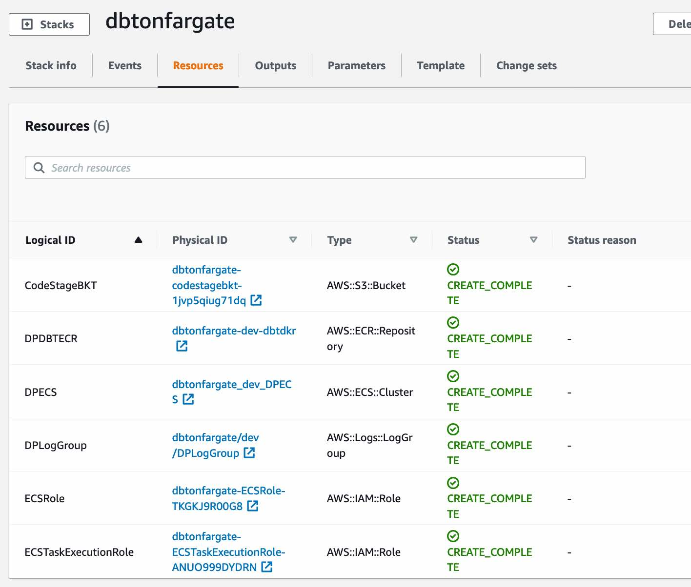
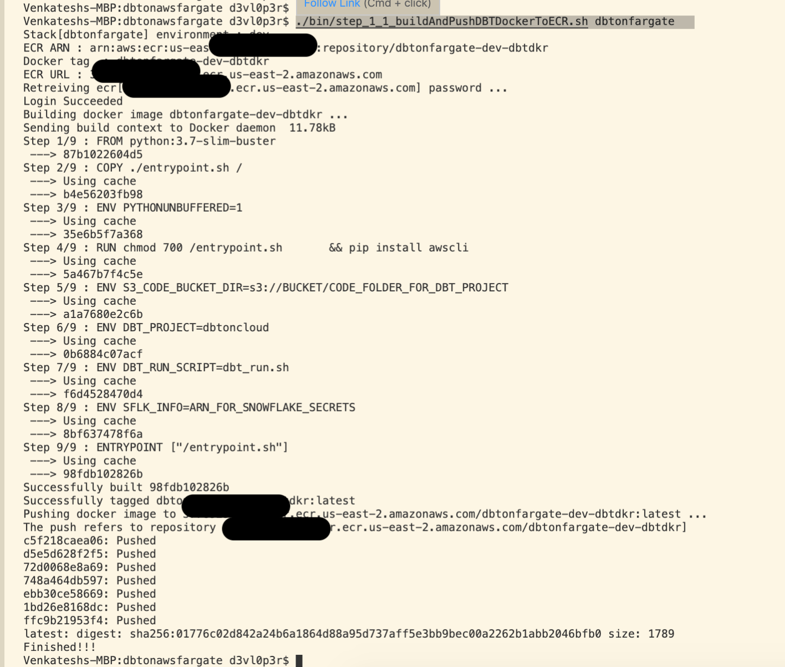
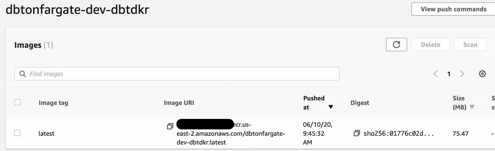
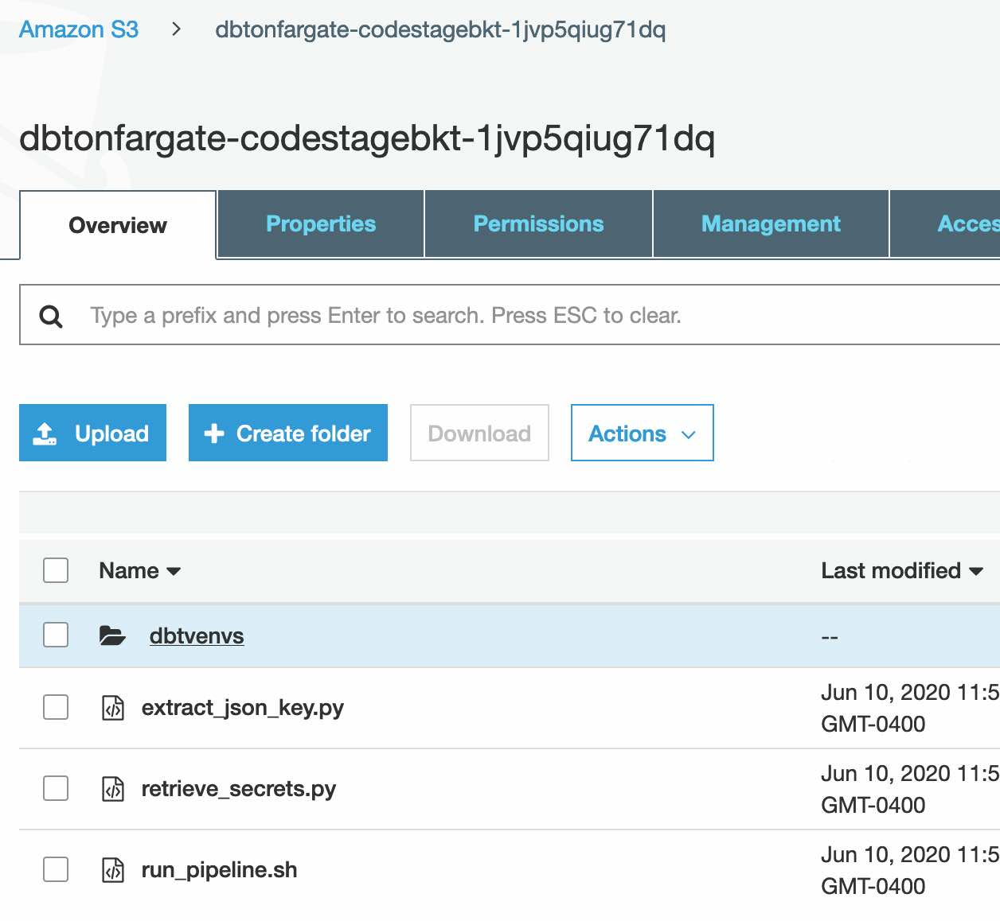
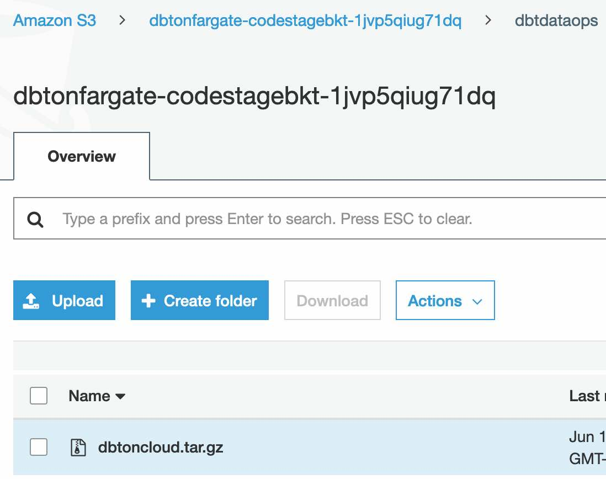
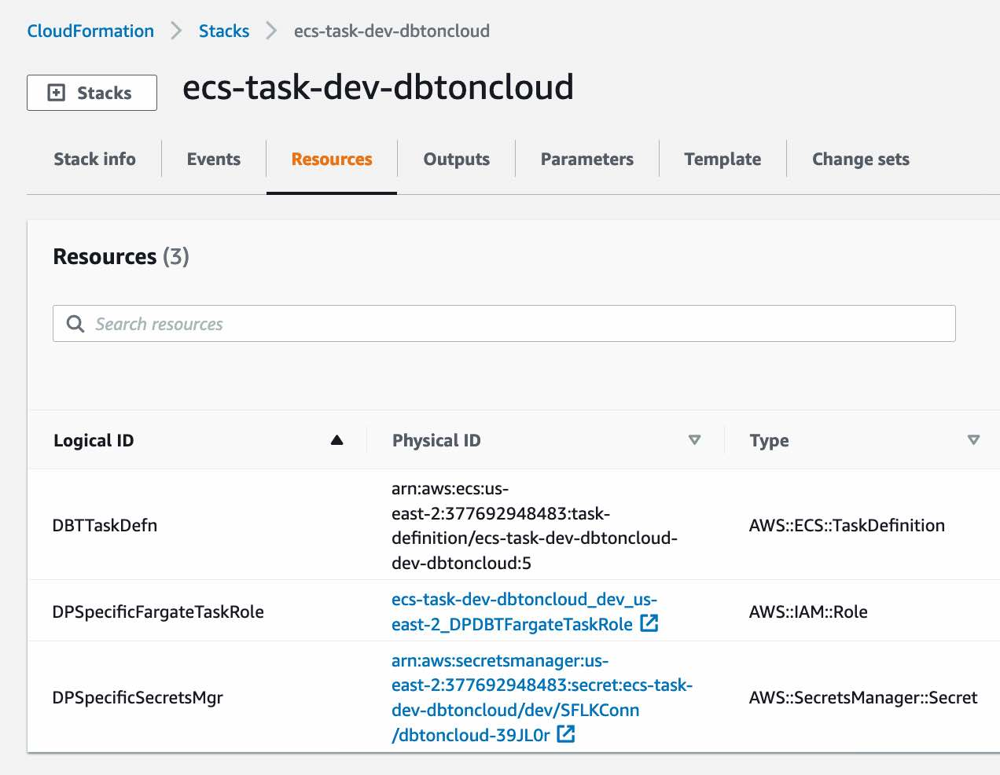
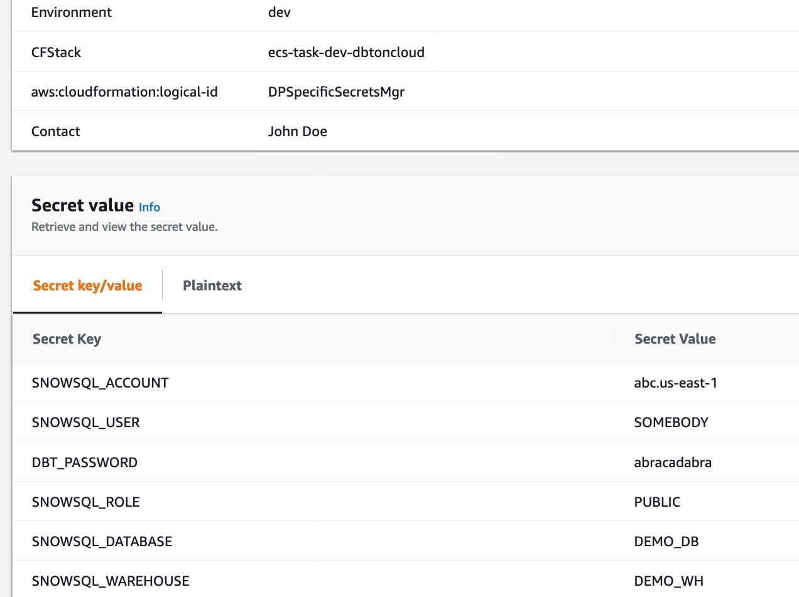

# Deployment

This section will walk through the various steps in deploying the implementation in AWS. The walk through is developer/administrator focused, 
hence it is a pre-requisite that the audience be familiar in:
- AWS Cloudformation
- DBT
- Docker
- IAM roles & policies
- Fargate
- Fargate task definition
- Cloud watch

I have prepared the various deployment artifacts and automated as much as possible to ease you into a quick deployment. If you 
are going to be adopting the solution, you would need update the scripts and templates etc as per your organization standards.

You would need the following tools
  - "aws cli" installed and configured. 
  - The script are also based of Bash, hence a mac/linux terminal would be ideal. for windows you might need to develop from scratch (sorry!!).

Ensure that you have following IAM permissions:
  - Create IAM roles
  - Define IAM policies
  - Create AWS resources, the list of resource is mentioned above.
  - Delete these resources, after prototyping
  - Create, Update ,Delete cloudformations 

## High level walkthrough
In the following section, i walk through deploying various artifacts in specific order. This is a 
high level perspective on the steps, detailed section is after this section.
1. Optionally configure a VPC

2. Deploy resource that is common
  - S3 code bucket
  - ECR
  - ECS cluster
  - IAM roles
  - Cloud watch log group

3. Build Docker image and deploy to ECR

4. Package DBT and other runtime scripts and deploy to S3

5. Package DBT project and deploy to S3

6. Define DBT datapipeline specific resource related to Task
  - IAM roles specific to DBT data pipeline
  - AWS Secrets specific to DBT data pipeline
  - Fargate Task specific to DBT data pipeline

It takes less than 15 min to do a complete end to end install.

----

## Step-0: Configure VPC
The Fargate cluster and tasks will run in a client VPC. It would be ideal, that the you use an existing VPC and a subnet (which has routes to reach public internet) as your first choice. The reason being you
have probably secured access ,defined security groups etc..

In case you are pretty greenfield, then a cloudformation script [cloudformation/vpc-public.yaml](cloudformation/vpc-public.yaml), is provided. This creates a VPC with 2 public subnets.

```shell
aws cloudformation create-stack --stack-name dbtonaws-nw --template-body file://cloudformation/vpc-privatepublic.yaml
```

## Step-1-0: Configure AWS resources
In this step, you will be deploying the following resources using the cloudformation template [cloudformation/dbtonfargate.yaml](cloudformation/dbtonfargate.yaml). 

- S3 code bucket
- ECR
- ECS cluster
- IAM roles
- Cloud watch log group

The description of these resource and what they play are commented in the template.
```shell
aws cloudformation create-stack --stack-name dbtonfargate --template-body file://cloudformation/dbtonfargate.yaml --capabilities CAPABILITY_NAMED_IAM
```
Once completed you will resource like below:


## Step-1-1: Build Docker image and push to ECR
In this step, we will build the docker image and push it to ECR. The Dockerfile and its dependent artifacts are present in the folder [dbtdocker](../dbtdocker)

We will use the shell script [bin/step_1_1_buildAndPushDBTDockerToECR.sh](../bin/step_1_1_buildAndPushDBTDockerToECR.sh) for this step. The script will take the stack name ,created in Step-1-0, as an argument. It will inspect the output variables in the stack and use the information to fill in. Hence data entry is kept minimal.

```shell
./bin/step_1_1_buildAndPushDBTDockerToECR.sh dbtonfargate
```

Here is the sample of whats gets outputted:


You should see the docker in the ECR like below:


## Step-1-2: Package DBT and push to S3 bucket
In this step, we will 
 - instantiate a temporary docker ,mounted to a local directory
 - build a virtual environment with dbt installed
 - exit out of Docker
 - Package the dbt virtual env
 - Upload this artifact into S3.

 ### Why do we do this virtual environment inside a docker ?
 Virtual environment is not trully portable, as of today portability is still in beta stage.
 The path under which the virtual environment is created is also embedded in the scripts that 
 gets created. Hence we mount a local directory under a specific path (/tmp/var/appdir/) in the docker image.
 The virtual env is created under the directory '/tmp/var/appdir/' and the dbt packages 
 are installed.

 The directory needs to be '/tmp/var/appdir/' as when the Fargate container instantiates
 it will create this directory ,in the ephemeral storage, and activates the virtual env.

 ### Why get the DBT using a docker ?
 The DBT depends on os specific libraries. If i build and package the DBT using Mac, the
 DBT library does not work well in the linux based container. Hence to avoid any 
 distruption due to OS, we download dbt in the same linux version as where the 
 code will execute.
 
 ### Zip vs tar.gzip ?
 When copying from S3, i found that it takes a lot more time to download zip in comparison to
 gzipped tar. Hence we decided upon gzipped tar as the archive.

we use the script [bin/step_1_2_packageDBTAndPushToS3.sh](../bin/step_1_2_packageDBTAndPushToS3.sh) to 
achieve this functionality. Similar to the earlier script this also depends on fetching information from
the deployed cloud stack. hence the stack name is the only parameter needed.

```shell
./bin/step_1_2_packageDBTAndPushToS3.sh dbtonfargate
```

Once the process is finished you would the following artifacts in the S3 bucket:


----

## Step-2-1: Deploy DBT project to S3 bucket
In this step, we would package a DBT project and deploy to the S3 bucket. In a typical implementation
this would be done by individual DBT project CI/CD pipelines.

For the sake of demo, i have packaged a dummy DBT project [dbtdataops/dbtoncloud](../dbtdataops/dbtoncloud).
In real world, various dbt pipeline project would package its artifact and store in S3. The logic behind
packaging and deploying is whats demonstrated here. The packaged name should be the same as the dbt project
name (ex: dbtoncloud.tar.gz)

We will be using the script [bin/step_2_1_deploy_dbt_project.sh](../bin/step_2_1_deploy_dbt_project.sh), for this execution.

```shell
./bin/step_2_1_deploy_dbt_project.sh dbtonfargate
```
once finished you will find the packaged dbt project under the 'dbtdataops' folder in S3 as below:


## Step-2-2: Define a task definition and other resources related to the DBT project
In this step, we would create the following resources
  - A FargateTaskRole specific to the DBT project
  - A secrets specific to the DBT project
  - A Fargate task definition specific to the DBT project
In a typical implementation this would be done by individual DBT project CI/CD pipelines.

We define project specific role to protect resource ex Secrets to only to the project specific
role.

The cloudformation template [cloudformation/dbt_taskdef.yaml](../cloudformation/dbt_taskdef.yaml)
and the script [bin/step_2_2_define_taskdefn.sh](../bin/step_2_2_define_taskdefn.sh) will be used
in the deployment.

This script requires an additional parameter, the name of the dbt project.
```shell
./bin/step_2_2_define_taskdefn.sh dbtonfargate dbtoncloud
```

Once deployed, you will find that the resources created as reflected from the cloudformation
stack:


## Step-2-3: Optionally update the secrets value
If you had used the script, by default its configured to inject a dummy set of values for the snowflake
connection. You should update the value to appropriate value.



----

That ends the deployment process