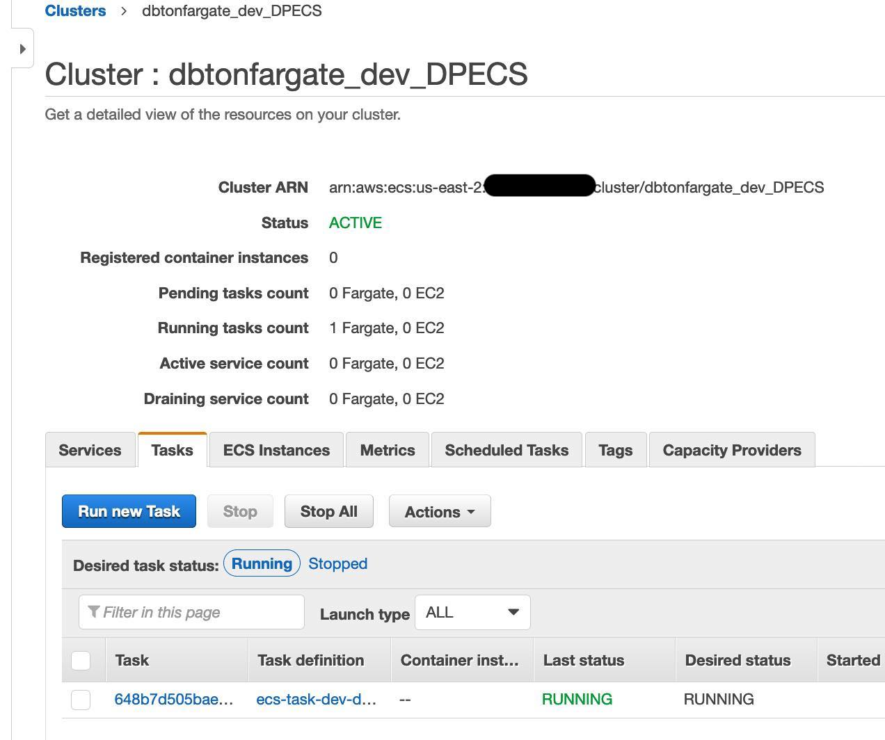
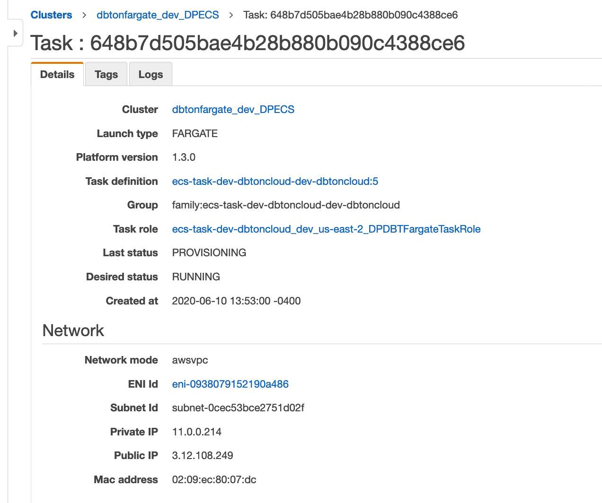
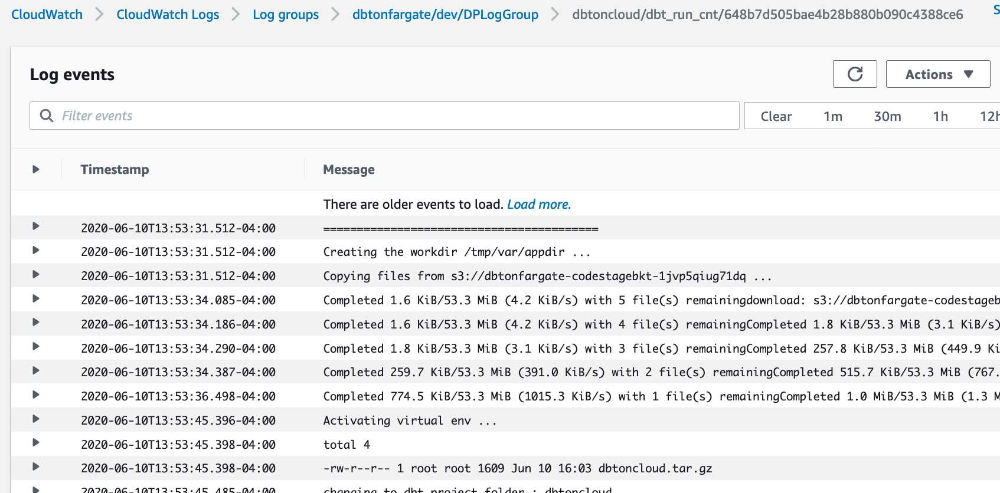
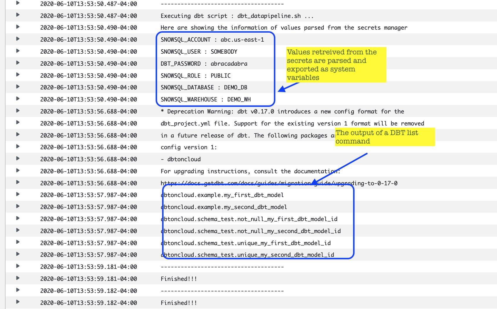
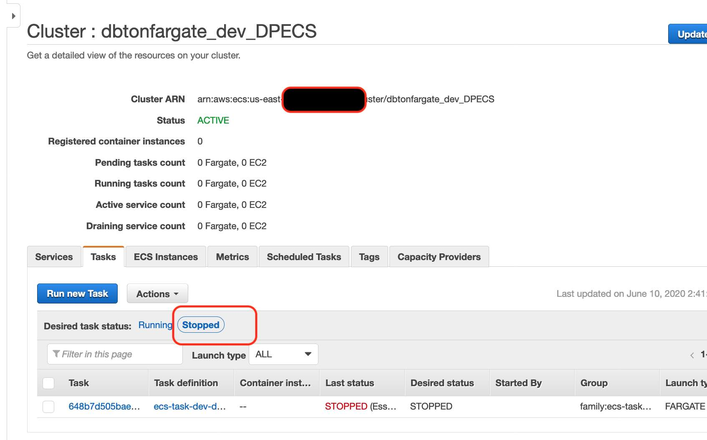

# Sample execution 

To give you a perspective, i have captured some output and screenshot of a sample execution. 

## Invoking the fargate Task
The easier way to start a fargate task is using the Fargate console UI. I am showing how we
can start a task as below:

```shell
aws ecs run-task \
  --task-definition ecs-task-dev-dbtoncloud-dev-dbtoncloud:5 \
  --launch-type FARGATE \
  --cluster dbtonfargate_dev_DPECS \
  --network-configuration "awsvpcConfiguration={subnets=['subnet-0cec53bce2751d02f'],securityGroups=['sg-0bbbc21b78e9369ed'],assignPublicIp='ENABLED'}" \
  --overrides '{ "containerOverrides": [ { "name": "dbt_run_cnt", "environment": [ { "name": "DBT_RUN_SCRIPT", "value": "dbt_datapipeline.sh" }  ] } ] }' 
```

When executing in your environment, you would need to update the following if you are running:
- task-definition => the task definition with the version number
- cluster => the cluster name, for ex: dbtonfargate_dev_DPECS
- network-configuration => the subnet and a security group.
- overrides => This will change based of the dbt project, for the demo we are still using the scripts from the sample dbtoncloud project.

Once the run task is invoked you would find the task instance in ECS like below:


The details of task info :


When task is executed its logs gets captured in the cloud watch 
log as below:


In the below log lines i am demonstrating the secrets getting parsed
and available as system variable. I am also demonstrating a sample
dbt command run:


Once the dbt task gets completed, the task instance shutsdown
